# Ingestion Worker File Relationships

This directory has two entry paths that now share the same ingestion logic:

- local development: `python -m ingestion_local`
- Kafka workers: modules under `workers/`

Both paths use the reusable functions under `pipeline/`.

## Relationship Diagram

```mermaid
flowchart TD
  subgraph SharedModels
    Config[config.py]
    Schemas[schemas.py]
    Common[packages/rag-common]
  end

  subgraph LocalPath
    CLI[ingestion_local.py]
    Runner[pipeline/runner.py]
  end

  subgraph Pipeline
    Parse[pipeline/parse.py]
    Risk[pipeline/risk_scan.py]
    Chunk[pipeline/chunk.py]
    CJK[pipeline/cjk_segmenter.py]
    Enrich[pipeline/enrich.py]
    ACL[pipeline/acl_bind.py]
    Embed[pipeline/embed.py]
    ESIndex[pipeline/index.py]
    Tokenizer[pipeline/tokenizer.py]
  end

  subgraph KafkaPath
    BaseKafka[kafka_worker.py]
    ParserWorker[workers/parser_worker.py]
    RiskWorker[workers/risk_scanner_worker.py]
    ChunkerWorker[workers/chunker_worker.py]
    EnricherWorker[workers/enricher_worker.py]
    ACLWorker[workers/acl_binder_worker.py]
    EmbeddingWorker[workers/embedding_worker.py]
    IndexerWorker[workers/indexer_worker.py]
    ConnectorWorker[workers/connector_worker.py]
  end

  subgraph Tests
    UnitTests[tests unit]
    IntegrationTests[tests integration]
  end

  CLI --> Runner
  Runner --> Parse
  Runner --> Risk
  Runner --> Chunk
  Runner --> Enrich
  Runner --> ACL
  Runner --> Embed
  Runner --> ESIndex

  ParserWorker --> BaseKafka
  RiskWorker --> BaseKafka
  ChunkerWorker --> BaseKafka
  EnricherWorker --> BaseKafka
  ACLWorker --> BaseKafka
  EmbeddingWorker --> BaseKafka
  IndexerWorker --> BaseKafka

  ParserWorker --> Parse
  RiskWorker --> Risk
  ChunkerWorker --> Chunk
  EnricherWorker --> Enrich
  ACLWorker --> ACL
  EmbeddingWorker --> Embed
  IndexerWorker --> ESIndex

  Chunk --> Tokenizer
  Chunk --> CJK
  Embed --> Tokenizer

  Config --> CLI
  Config --> Runner
  Config --> BaseKafka
  Config --> Pipeline
  Schemas --> Runner
  Schemas --> Pipeline
  Schemas --> KafkaPath
  Common --> ACL
  Common --> Schemas

  UnitTests --> Pipeline
  UnitTests --> KafkaPath
  IntegrationTests --> Pipeline
  IntegrationTests --> KafkaPath
```



Readable flow:

```text
ingestion_local.py
  -> pipeline/runner.py
  -> parse -> risk_scan -> chunk -> enrich -> acl_bind -> embed -> index

workers/*_worker.py
  -> kafka_worker.py for Kafka consume/produce
  -> matching pipeline/* module for stage logic
```

## Local Direct Runner

`ingestion_local.py` is the local developer entry point.

- `init-indexes` calls `pipeline/index.py` to create local Elasticsearch indexes and aliases.
- `ingest` calls `pipeline/runner.py` to process local files in process.
- `--dry-run` stops before OpenAI and Elasticsearch writes.
- `--embedding-provider openai` forces both L0/L1 and L2/L3 local embeddings to OpenAI.
- `--language auto|zh|ja` controls CJK chunking. Use `ja` for Japanese documents
  with lots of kanji so they use `fugashi` instead of auto-detecting as Chinese.

`pipeline/runner.py` owns the local orchestration:

```text
discover files
  -> make IngestionJob
  -> parse
  -> risk scan
  -> chunk
  -> enrich
  -> select and bind ACL
  -> embed, unless dry-run
  -> index, unless dry-run
```

## Reusable Pipeline Stages

- `pipeline/parse.py`: converts raw markdown, HTML, PDF, wiki export, or structured text into `ParsedSection` records.
- `pipeline/risk_scan.py`: detects sensitivity, sanitizes simple injection strings, and returns quarantined jobs when needed.
- `pipeline/chunk.py`: splits parsed sections into overlapping `Chunk` records.
- `pipeline/cjk_segmenter.py`: uses `jieba` for Chinese and `fugashi` for Japanese before chunk assembly. The local CLI can force `zh` or `ja`; otherwise it auto-detects.
- `pipeline/enrich.py`: adds deterministic `doc_id` and `chunk_id`, plus topic, doc type, and year metadata.
- `pipeline/acl_bind.py`: loads ACL policy YAML, matches by source-relative path, creates `acl_tokens`, and computes `acl_key`.
- `pipeline/embed.py`: calls embedding providers and attaches vectors to chunks.
- `pipeline/index.py`: creates local ES aliases and builds/writes bulk documents with query-service fields.
- `pipeline/tokenizer.py`: loads `tiktoken`; if the encoding file is unavailable locally, it falls back so tests and dry-runs still work.

## Kafka Worker Path

The files under `workers/` are Kafka wrappers. Each worker consumes one topic, calls the matching reusable pipeline function, and produces the next topic.

```text
workers/parser_worker.py        -> pipeline/parse.py
workers/risk_scanner_worker.py  -> pipeline/risk_scan.py
workers/chunker_worker.py       -> pipeline/chunk.py
workers/enricher_worker.py      -> pipeline/enrich.py
workers/acl_binder_worker.py    -> pipeline/acl_bind.py
workers/embedding_worker.py     -> pipeline/embed.py
workers/indexer_worker.py       -> pipeline/index.py
```

`kafka_worker.py` contains the common Kafka consume/produce loop. `connector_worker.py`
is the source-job producer side and is still separate from the stage pipeline.

## Shared Files

- `config.py`: environment-backed settings for Kafka, Elasticsearch, embeddings, ACL versions, and chunking.
- `schemas.py`: re-exports ingestion models from `packages/rag-common`.
- `Dockerfile`: builds the ingestion worker image.
- `pyproject.toml`: package dependencies for ingestion workers.

## Tests

- `tests/unit/test_local_ingestion_runner.py` checks the local direct runner and ES document shape.
- `tests/unit/test_*_worker.py` checks individual worker behavior.
- `tests/integration/test_ingestion_pipeline.py` checks the staged ingestion behavior across workers.
